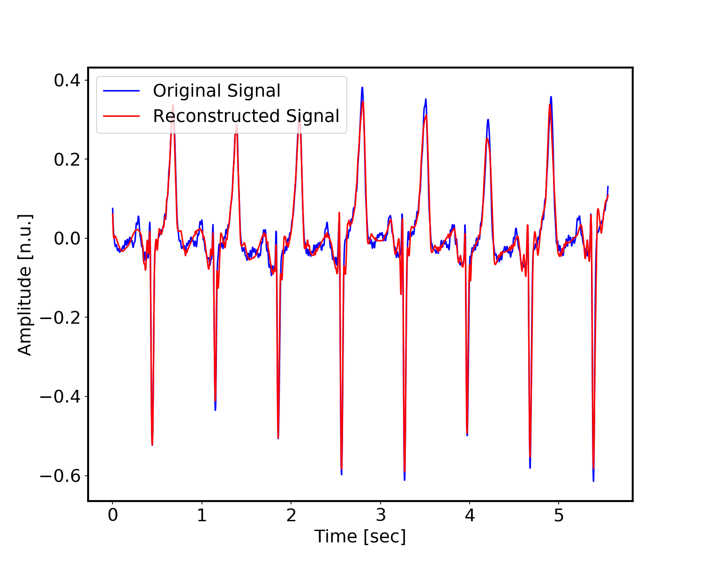
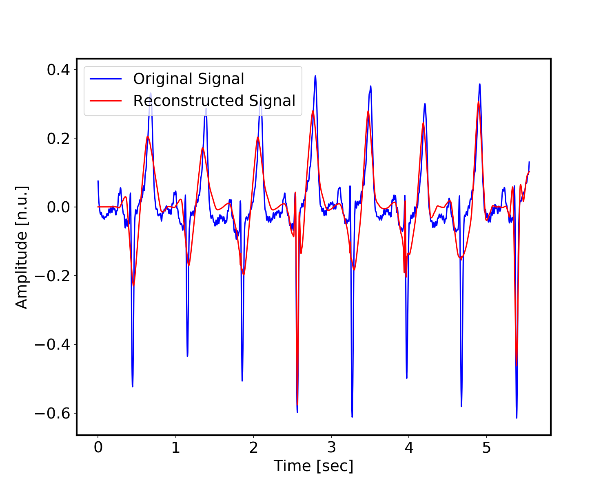
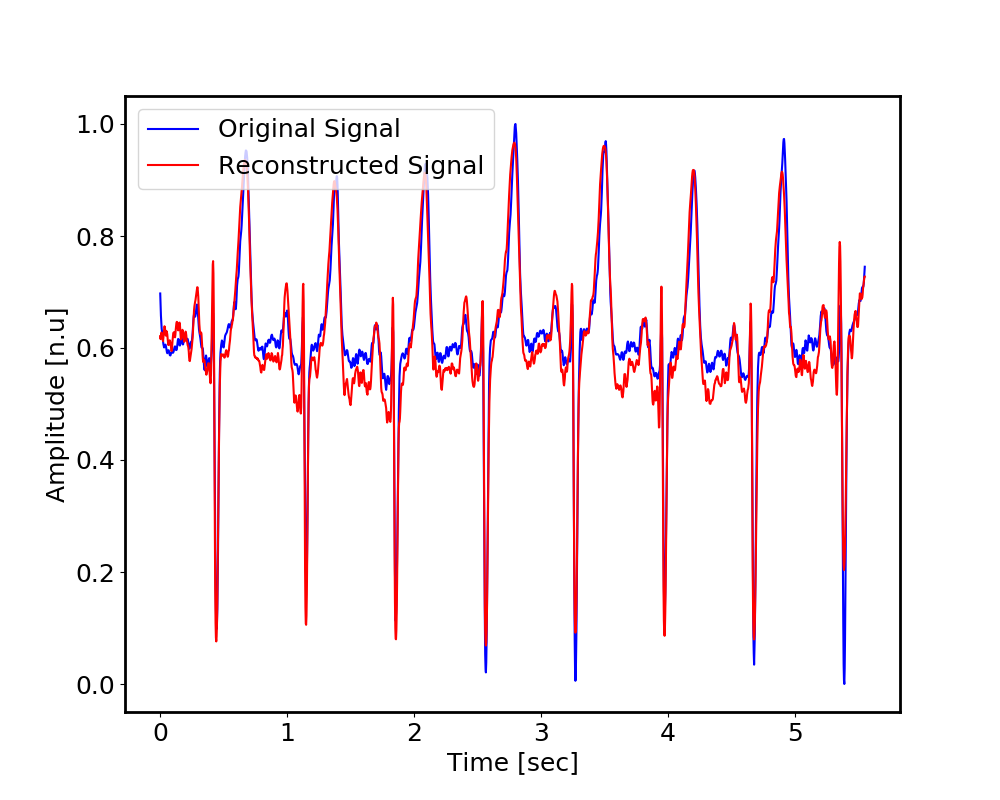

***Compression For Continuous Long-Term Electrocardiography Recordings***

Project B - EE Technion

[Noam Ben-Moshe](https://github.com/noambenmoshe) and [Noa Cohen](https://github.com/noac-github)

**Abstract**

This project researches compression algorithms to create a sparse representation of a continuous long-term electrocardiography (ECG) recording while preserving its diagnostic information. This will enable storing and transmitting continuous long-term ECG recordings, crucial for a portable collection system that will collect mobile ECG data continuously recorded for hours to days long.

**Project**

We implemented two baselines, one is a lossy method that is transformed based  where we used [nerajbobra's git repository](https://github.com/nerajbobra/wavelet-based-ecg-compression) and the other is parameter extraction based which is a deep convolutional auto-encoder. We then tried to improve the deep convolutional auto-encoder method and the results are presented in the project book.

The full project book can be found in: [Project Book](./ECG_project_book.pdf)

**The Code**

The database used in this project is The University of Virginia Database (UVAF) consisting of RR interval time-series and rhythm annotations.
To improve running time while training the HDF5 library was used to store the data. As the database contains private data we can not make it public, you can download ECG data from the [PhysioNet Apnea-ECG Database](https://www.physionet.org/physiobank/database/apnea-ecg/) and make HDF5 files out of it. In [hdf5.py](./hdf5data.py) you can see how we converted our data into HDF5 files.
Once there are HDF5 files you can run the Wavelet baseline in [baseline.py](./Wavelet_baseline/baseline.py).
You can train the deep convolutional auto-encoder in the [training.py](./training.py) and then you can check the results of your model in [inference.py](./inference.py).

**Examples**

Below you can see the same ECG segment constructed by different models from our project.

Reconstructed segment by the wavelet baseline  Compression Ratio (CR)-8.532

Reconstructed segment by the wavelet baseline with adapted parameters CR-32.342

Reconstructed segment by our implementation of the deep baseline after tuning hyper parameters CR-32.25
